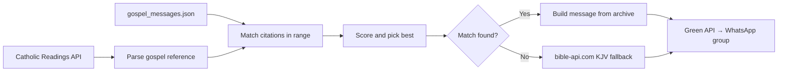

<div align="center">

# Gospel Bot

**Daily gospel reflections for the family group — on time, with grace.**

[](https://nodejs.org/)
[](https://green-api.com/)

*Matches today's Catholic lectionary to a personal archive of messages, then sends the best one — with email previews, retries, and a quiet watchdog.*

<br/>

```
     ·  archive of love  ·  API of the day  ·  one message at midnight  ·
```

<br/>

</div>

---

## Why it exists

Years of thoughtful **"Gospel Msg"** notes live in a WhatsApp archive. This bot keeps that voice alive for the group: it pulls **today's gospel** from the [Catholic Readings API](https://github.com/cpbjr/catholic-readings-api), finds archive entries whose citations fall inside that reading, picks the strongest match, and **delivers it automatically** — with a safety net if anything goes wrong.

---

## A day in the life

All schedules use **`Asia/Kolkata` (IST)**.

| When | What happens |
|------|----------------|
| **5:00 PM** | Tomorrow's message is emailed to the preview inbox so someone can forward manually if needed. |
| **12:30 AM** | The chosen message goes to the configured WhatsApp group via Green API (with retries). |
| **1:00 AM** | Watchdog: if nothing was logged as sent, the bot tries again and alerts by email. |

If all retries fail, the message is **queued** and flushed on the next successful send. The 5 PM preview email to mom serves as the final manual fallback.

---

## How the message is chosen



`gospel_matcher.js` normalizes book names (e.g. **JH**, **LK**, **MT**, **MK**) and handles both API-style references and the archive's citation format — including multi-chapter readings like Good Friday (`John 18:1–19:42`) and non-standard formats like `JH(19-28-30)`.

---

## Stack

| Piece | Role |
|-------|------|
| [Green API](https://green-api.com/) | WhatsApp session and group send via REST |
| [node-cron](https://www.npmjs.com/package/node-cron) | IST scheduling |
| [nodemailer](https://nodemailer.com/) | Gmail alerts and previews |

No headless browser. No Puppeteer. No session files to manage.

---

## Quick start

### Prerequisites

- **Node.js 18+**
- A **Green API** account (free Developer plan at [green-api.com](https://green-api.com)) — scan QR once on their dashboard, never again
- A **Gmail** account with an [App Password](https://myaccount.google.com/apppasswords) for SMTP

### Install

```bash
git clone https://github.com/YOUR_USERNAME/gospel-bot.git
cd gospel-bot
npm install
```

### Environment

| Variable | Description |
|----------|-------------|
| `GREEN_API_ID` | Your Green API instance ID |
| `GREEN_API_TOKEN` | Your Green API token |
| `GROUP_ID` | WhatsApp group ID e.g. `120363XXXXXX@g.us` — find it in Green API dashboard → Contacts |
| `EMAIL_USER` | Gmail address used to send mail |
| `EMAIL_PASS` | Gmail App Password |
| `ALERT_EMAIL` | Where operational alerts go (your email) |
| `PREVIEW_EMAIL` | Where the 5 PM preview goes (mom's email) |
| `TRIGGER_PORT` | Optional. Local HTTP port (default `3000`) |

### Run

```bash
npm start
```

For production, run under **PM2** so it survives reboots:

```bash
pm2 start app.js --name gospel-bot
pm2 startup && pm2 save
```

---

## Manual triggers

### CLI

```bash
node app.js --trigger-now                        # send today's message now
node app.js --trigger-now --date=2026-04-17      # send for a specific date
node app.js --preview-now                        # send preview email to mom now
```

### HTTP (bot must be running via pm2)

```bash
curl http://localhost:3000/trigger
curl "http://localhost:3000/trigger?date=2026-04-17"
curl http://localhost:3000/preview
curl http://localhost:3000/status
```

---

## Validation

Test the full chain locally before deploying — API call, parsing, archive matching, and final message:

```bash
node test.js today
node test.js 2026-04-17
node test.js 2026-04-17 2026-04-18 2026-04-19    # multiple dates at once
```

Shows the raw API response, parsed reference, all archive matches with scores, and the final message in a box. Run this with dad to validate a week of dates before going live.

---

## Data files

| File | Notes |
|------|--------|
| `gospel_messages.json` | Parsed archive — ship this with the bot |
| `sent.log.json` | Rolling 90-day send log (gitignored) |
| `pending.json` | Queue for failed sends (gitignored) |

### Rebuilding the archive from a fresh WhatsApp export

```bash
node parse_gospel.js    # reads _chat.txt, writes gospel_messages.json
```

Update `INPUT_FILE` in `parse_gospel.js` to point at your export path.

---

## Credits

- Daily readings: [cpbjr/catholic-readings-api](https://github.com/cpbjr/catholic-readings-api)
- Scripture fallback: [bible-api.com](https://bible-api.com/)
- WhatsApp delivery: [Green API](https://green-api.com/)

---

<div align="center">

**Peace be with you.**

<sub>Built with care for family and the living word.</sub>

</div>