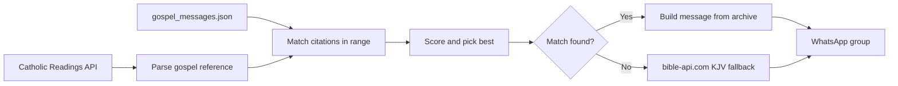

<div align="center">

# Gospel Bot

**Daily gospel reflections for the family group — on time, with grace.**

[](https://nodejs.org/)
[](https://github.com/pedroslopez/whatsapp-web.js)

*Matches today’s Catholic lectionary to a personal archive of messages, then sends the best one — with email previews, retries, and a quiet watchdog.*

<br/>

```
     ·  archive of love  ·  API of the day  ·  one message at midnight  ·
```

<br/>

</div>

---

## Why it exists

Years of thoughtful **“Gospel Msg”** notes live in a WhatsApp archive. This bot keeps that voice alive for the group: it pulls **today’s gospel** from the [Catholic Readings API](https://github.com/cpbjr/catholic-readings-api), finds archive entries whose citations fall inside that reading, picks the strongest match, and **delivers it automatically** — with a safety net if anything goes wrong.

---

## A day in the life

All schedules use **`Asia/Kolkata` (IST)**.

| When | What happens |
|------|----------------|
| **5:00 PM** | Tomorrow’s message is emailed to the preview inbox (so someone can forward manually if needed). |
| **12:30 AM** | The chosen message goes to the configured WhatsApp group (with retries). |
| **1:00 AM** | Watchdog: if nothing was logged as sent, the bot tries again and alerts by email. |

If WhatsApp drops, messages can be **queued** and flushed when the client reconnects. A fresh **QR** triggers an email with a scannable image for re-linking.

---

## How the message is chosen



`gospel_matcher.js` normalizes book names (e.g. **JH**, **LK**, **MT**, **MK**) and handles both API-style references and Dad’s citation format.

---

## Stack

| Piece | Role |
|-------|------|
| [whatsapp-web.js](https://github.com/pedroslopez/whatsapp-web.js) | Linked-device session, group send |
| [node-cron](https://www.npmjs.com/package/node-cron) | IST scheduling |
| [nodemailer](https://nodemailer.com/) | Gmail alerts & previews |
| [qrcode](https://www.npmjs.com/package/qrcode) | QR image when re-auth is needed |

---

## Quick start

### Prerequisites

- **Node.js 18+** (uses native `fetch` in the matcher)
- A **Gmail** account with an [App Password](https://myaccount.google.com/apppasswords) for SMTP
- WhatsApp on a phone you can use for **Linked devices**

### Install

```bash
git clone https://github.com/YOUR_USERNAME/gospel-bot.git
cd gospel-bot
npm install
```

### Environment

Set these on the process (shell, **PM2** `ecosystem.config.cjs`, Windows **System Properties → Environment Variables**, etc.). The app reads `process.env.*` only — it does not load a `.env` file unless you add something like `dotenv` yourself. Never commit secrets; `.env` is listed in `.gitignore` for local convenience if you use a loader.

| Variable | Description |
|----------|-------------|
| `GROUP_ID` | WhatsApp group id, e.g. `1234567890-1234567890@g.us` |
| `EMAIL_USER` | Gmail address used to send mail |
| `EMAIL_PASS` | Gmail App Password |
| `ALERT_EMAIL` | Where operational emails go |
| `PREVIEW_EMAIL` | Where the 5 PM “tomorrow” preview goes |
| `TRIGGER_PORT` | Optional. Local HTTP port (default `3000`) |

### First run: find the group id

```bash
npm run list-groups
```

Scan the QR on the linked phone, then copy the id next to the right group into `GROUP_ID`.

### Run normally

```bash
npm start
```

For production, run under **PM2** (or similar) so it survives restarts — the comments in `app.js` mention `pm2 logs gospel-bot`.

---

## Useful commands

| Command | Purpose |
|---------|---------|
| `npm start` | Start the bot (cron + WhatsApp + local trigger server) |
| `npm run list-groups` | Print group names and ids after QR login |
| `node app.js --trigger-now` | Send today’s message immediately |
| `node app.js --trigger-now --date=YYYY-MM-DD` | Send for a specific date |
| `node app.js --preview-now` | Send the preview email now |
| `node gospel_matcher.js` | Matcher self-test / debug output |
| `node test.js today` | Full-chain validation for today |
| `node test.js 2026-04-17` | Validate one or more dates |

### Local HTTP triggers (binds to `127.0.0.1`)

```bash
curl http://localhost:3000/status
curl http://localhost:3000/trigger
curl http://localhost:3000/preview
```

---

## Data files

| File | Notes |
|------|--------|
| `gospel_messages.json` | Parsed archive of gospel messages (metadata + `messages` array). Ship this with the bot. |
| `sent.log.json` | Rolling log of sends (gitignored). |
| `pending.json` | Queue when sends fail after retries (gitignored). |
| `session/` | WhatsApp session data (gitignored). |

### Rebuilding the archive from chat export

`parse_gospel.js` is a **one-off pipeline**; paths inside it point at a specific export layout. Adjust `INPUT_FILE` / `OUTPUT_FILE` (and `SENDER_NAME`) for your machine, then:

```bash
npm run parse
```

---

## Credits

- Daily readings: [cpbjr/catholic-readings-api](https://github.com/cpbjr/catholic-readings-api) (hosted JSON)
- Scripture fallback: [bible-api.com](https://bible-api.com/)

---

<div align="center">

**Peace be with you.**

<sub>Built with care for family and the living word.</sub>

</div>
